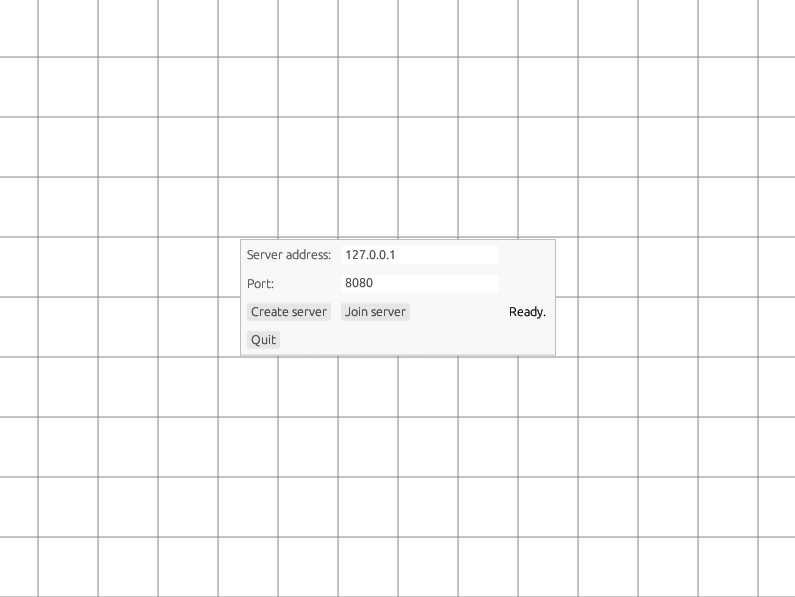
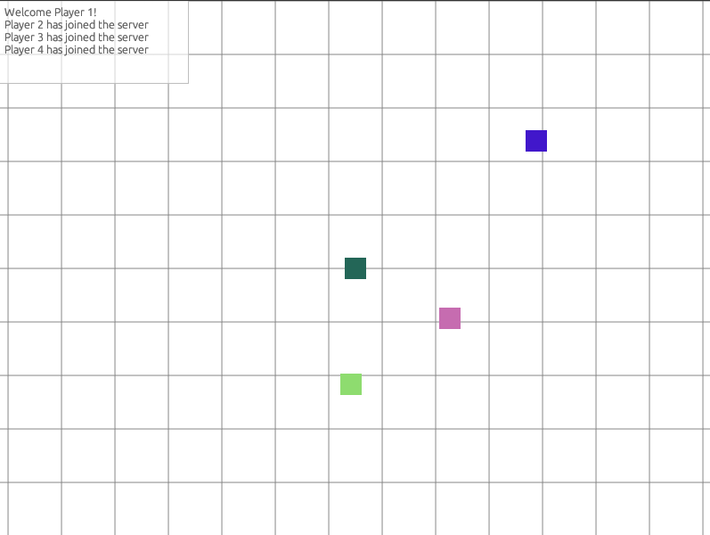

# Networked client-server multiplayer game demo written in Rust

[](https://github.com/balintkissdev/multiplayer-game-demo-rust/actions/workflows/ci.yml)

> A proof-of-concept networked multiplayer game demonstrating UDP socket programming and asynchronous runtime usage in Rust.




## Table of Contents

- [Try it out!](#try-it-out)
- [Motivation](#motivation)
- [Features](#features)
- [Requirements](#requirements)
- [Build instructions](#build-instructions)
- [Usage](#usage)

## Try it out!

- [Windows 64-bit download](https://github.com/balintkissdev/multiplayer-game-demo-rust/releases/download/0.1.1/multiplayer-game-demo-rust-0.1.1-win64.zip)
- [Linux 64-bit download](https://github.com/balintkissdev/multiplayer-game-demo-rust/releases/download/0.1.1/multiplayer-game-demo-rust-0.1.1-linux-x86_64.tar.gz)

## Motivation

This project is a demonstration to highlight my system-level network
programming skills with Rust programming language by creating a robust and
efficient application using real-time multiplayer game techniques. The project
showcases confident understanding of networking and concurrency concepts as
well as the use of Tokio async runtime.

This application was tested under `tc-netem` network emulator simulating
harsh network environment and packet loss, as well as live being deployed on a
remote Amazon EC2 virtual machine instance.

Using conventional threads for concurrency and parallelism can be expensive due
to the cost of requesting threads from the operating system and additional heap
allocations (although thread pools mitigate this). Rust has language support
for asynchronous programming, but does not ship with built-in implementation of
an async runtime due to increase in compiled binary size. Instead it is opt-in
with the inclusion of crates like [async-std](https://async.rs/),
[Tokio](https://tokio.rs/), [mio](https://github.com/tokio-rs/mio) and
[smol](https://github.com/smol-rs/smol). Tokio utilizes the concept of
*green-threading* (concept similar to goroutines in the Go programming
language) and the asynchronous I/O capabilities of the operating system
(`epoll` on Linux, `IOCP` on Windows and `kqueue` on macOS).

Game programming provides a challenging environment to put these concepts into
practice due to them being classified as *soft real-time systems*, requiring
response within a time of generating a frame in 16.666 milliseconds (60
frames/second). Although TCP network protocol is used in conventional software
systems, the `SYN/ACK` handshake procedure introduces additional latency.
Real-time multiplayer game developers utilize the UDP protocol for faster
responses at the cost of guaranteed packet delivery, and they create their own
custom-tailored reliability protocols on top of it.

## Features

- Client-server architecture for multiplayer networking. UDP socket
  communication for low-latency networking.
  - Health-check mechanism to detect lost network connections.
  - Reliability patterns to mitigate harsh network environments like UDP packet losses.
- Real-time multiplayer gameplay with smooth synchronization.
- Graphical client application with GUI menu
- Hardware-accelerated OpenGL rendering for 2D top-down perspective graphics.
- Flexible server hosting options:
  - Clients can host hybrid server sessions from GUI.
  - Headless/dedicated server-only mode running without GUI.

## Requirements

Desktop executable requires an OpenGL 2.1 compatible graphics adapter to run
(this version was chosen for compatiblity with GPUs as far back as July 2006).
Check if your hardware supports OpenGL 2.1 and have the latest graphics driver
installed.

Dependencies are automatically downloaded by `cargo`.

## Build instructions

1. Make sure you have the latest stable version of Rust and `cargo` installed, following the instructions on
https://www.rust-lang.org/tools/install

2. Clone the repository:

  ```sh
  git clone https://github.com/balintkissdev/multiplayer-game-demo-rust.git
  cd multiplayer-game-demo-rust
  ```

3. Compile and execute the release build:

  ```sh
  cargo run --release
  ```

### Docker

The application can also be deployed as a Docker container, which will run in server-only mode.

1. Build the Docker image:

```sh
docker build -t multiplayer-game-demo-rust .
```

2. Launch the Docker container. This starts with `--server-only` and `--trace` options by
default. See [Command line options](#command-line-options) for more info.

```sh
docker run -d -p 8080:8080 multiplayer-game-demo-rust
```

## Usage

You can test out the application on your local machine by executing multiple
instances of the application. One window acting as the server host and the
others joining as clients.

Use the keyboard to navigate the environment.

- Movement: Arrow cursor keys or `W`, `A`, `S`, `D`

### Server-only mode (headless server, dedicated server)

Start the application from the command line with `--server-only` switch. The
default port number is `8080` which can be modified with the `-p` or `--port=`
switch.

### Command line options

- `--server-only`: Starts a server only in headless mode without graphical user interface. Used for creating dedicated servers.
- `-p, --port=<PORT>`: Port number used for server in headless mode (--server-only). (default: `8080`)
- `--trace`: Enable tracing of UDP messages on console log.
- `-h, --help`: Print help.

